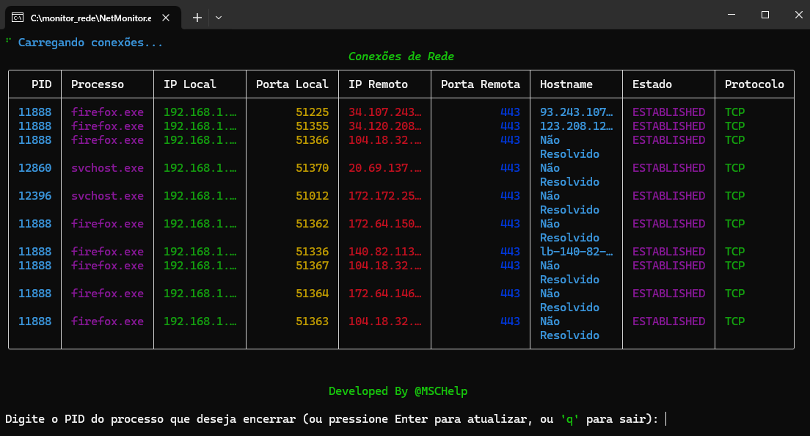

# 🚀 NetMonitor  


O **NetMonitor** é uma ferramenta prática e eficiente para monitoramento de conexões de rede **TCP** e **UDP** em tempo real. Ele proporciona uma visualização clara das conexões ativas, permitindo monitorar o tráfego e gerenciar portas de forma simples e eficaz.  

---  

## ✨ Funcionalidades  

✅ **Monitoramento de Conexões TCP** – Exibe conexões ativas com informações detalhadas.  
✅ **Monitoramento de Conexões UDP** – Acompanha tráfego sem conexão persistente.  
✅ **Encerramento de Conexões** – Finaliza processos ou libera portas facilmente.  
✅ **Interface Simples e Intuitiva** – Layout amigável com filtros para busca rápida.  
✅ **Relatórios em Tempo Real** – Atualização dinâmica das conexões.  

---  


## 💖 Contribua!

Quero continuar criando novos apps e trazendo novidades, mas para isso preciso da sua ajuda. Qualquer contribuição será muito bem-vinda!

Clique no link abaixo para fazer sua doação:

[**Faça uma doação no PayPal**](https://www.paypal.com/donate/?business=3ZQZK7TPGPSAA&no_recurring=0&item_name=Ajude+a+fortalecer+a+seguran%C3%A7a+digital%21+Sua+contribui%C3%A7%C3%A3o+faz+a+diferen%C3%A7a+no+futuro+do+NavegadorMatrix.&currency_code=BRL)

## 🛠 Instalação  

### 1️⃣ Clonar o repositório e configurar o ambiente  
```bash
git clone https://github.com/mcamargorj/NetMonitor.git
cd NetMonitor

# Criar e ativar o ambiente virtual (Windows)
python -m venv venv
venv\Scripts\activate

# Criar e ativar o ambiente virtual (Linux)
python -m venv venv
source venv/bin/activate

# Instalar as dependências
pip install -r requirements.txt

# Executar o NetMonitor
python netmonitor.py
