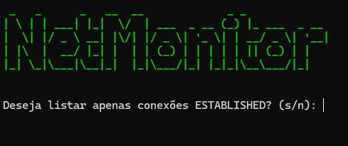

# 🚀 NetMonitor  



O **NetMonitor** é uma ferramenta prática e eficiente para monitoramento de conexões de rede **TCP** e **UDP** em tempo real. Ele proporciona uma visualização clara das conexões ativas, permitindo monitorar o tráfego e gerenciar portas de forma simples e eficaz.  

---  

## ✨ Funcionalidades  

✅ **Monitoramento de Conexões TCP** – Exibe conexões ativas com informações detalhadas.  
✅ **Monitoramento de Conexões UDP** – Acompanha tráfego sem conexão persistente.  
✅ **Encerramento de Conexões** – Finaliza processos ou libera portas facilmente.  
✅ **Interface Simples e Intuitiva** – Layout amigável com filtros para busca rápida.  
✅ **Relatórios em Tempo Real** – Atualização dinâmica das conexões.  

---  


## 🛠 Instalação  

### 1️⃣ Clonar o repositório e configurar o ambiente  
```bash
git clone https://github.com/mcamargorj/NetMonitor.git
cd NetMonitor

# Criar e ativar o ambiente virtual (Windows)
python -m venv venv
venv\Scripts\activate

# Instalar as dependências
pip install -r requirements.txt

# Executar o NetMonitor
python NetMonitor.py
